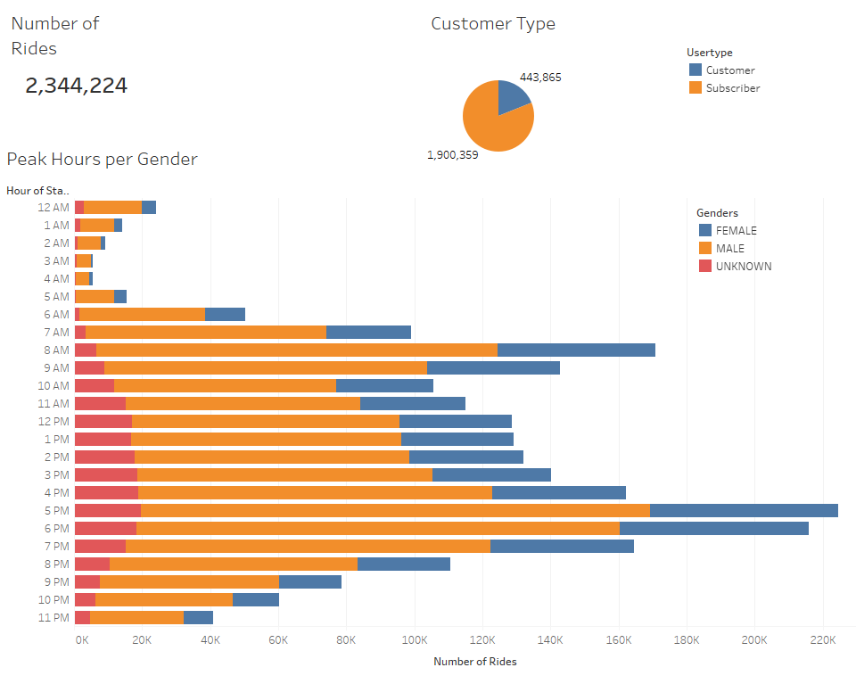
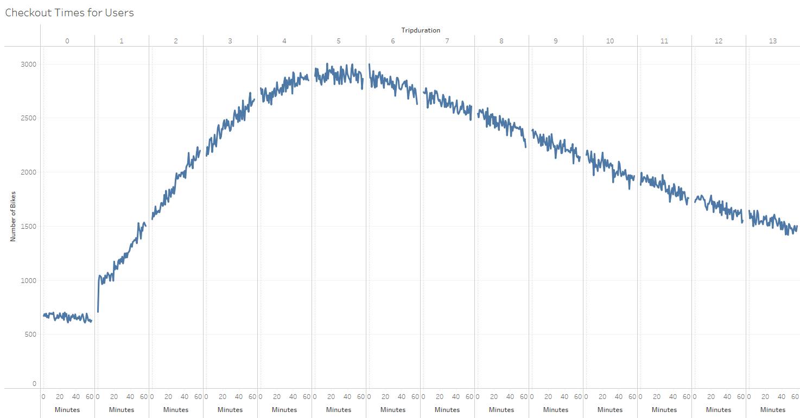
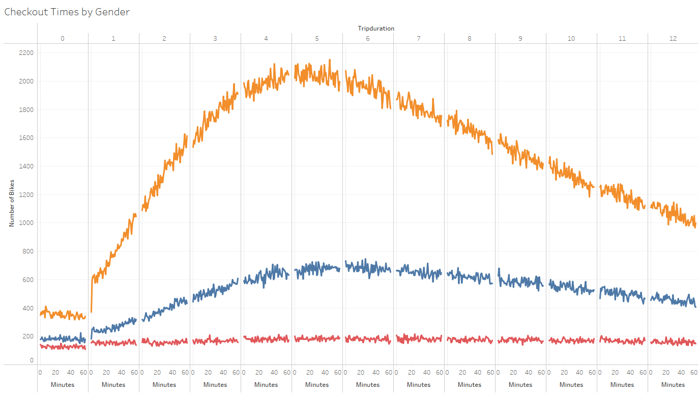
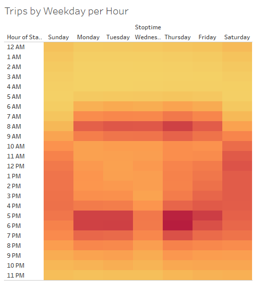
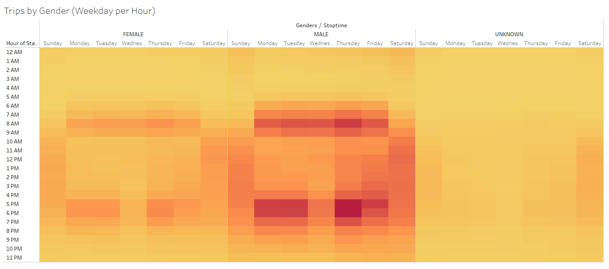
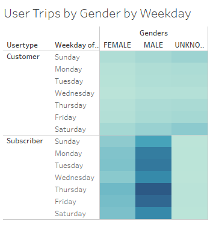
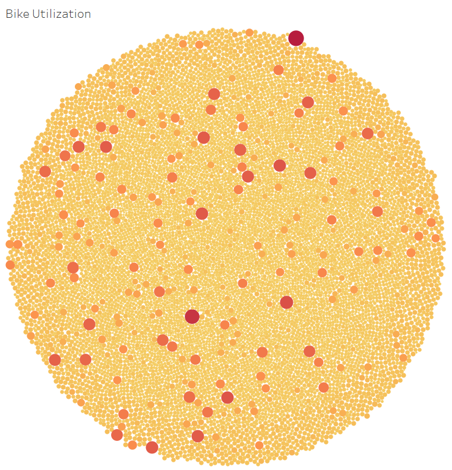
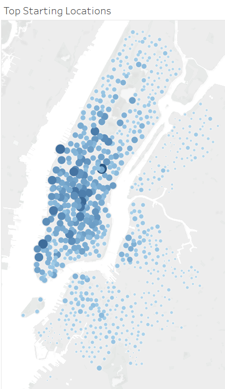
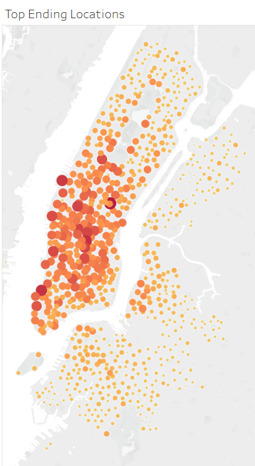

# NYC CitiBike
*Data Visualization with Tableau*

## Project Overview
### Purpose

For this project I am creating data visualization with Tableau for a bike sharing program in New York City. The idea is to analyze the data, see the mechanics of the business and figure out how the bike share business actually works in NYC. This is the first step of expanding the idea to other cities. With a strong and clear story, backed-up by data we can create a proposal on how the business could work in other cities as well.

**The Tableau story of the NYC CitiBike can be found in the following link:** [NYC CitiBike Story](https://public.tableau.com/app/profile/hanna.bustamane/viz/NYCCitiBike_16406258237970/NYCCitiBike?publish=yes)

For this project I am using:
-	Tableau to create visualizations, dashboard and story.
-	Pandas to convert integer to a datetime datatype.

## Resources 
-	Data Source:
    - [CitiBike Trip History Data from August 2019 in NYC](https://www.citibikenyc.com/system-data)
-	Software:
    - Tableau Public 2020.3
-	Languages & Environment:
    - Pandas, Python 3.7

## Results

### Basic Information

The first page of the story is the dashboard that contains basic information about the data set. The purpose of this page is to familiarize with the data and to introduce to the audience what kind of data we will be dealing with in the further analysis. 

The page contains the following information:
-	Type of business, time frame and location of the data: CitiBike, New York City, August 2019.
-	Number of the total rides: 2,344,224.
-	Customer type: subscribers and customers.
-	Peak hours, divided by gender, with at-a-glance information about user behavior.

### 1. Checkout Times for Users

The graph has number of checkout bikes (number of trips) on the y-axis and trip duration on the x-axis. X-axis is divided into hours (at the top) and minutes (at the bottom) for even more detailed information about trip duration. From the graph we can see that the most frequent trip duration is between 3 hours to 9 hours, followed by longer trip duration of 9+ hours (9-24 hours to be exact). Shorter trip duration between few minutes to 3 hours is the least frequent duration.

### 2. Check Out Time by Gender

The graph shows number of checkout bikes on the y-axis and trip duration on the x-axis. X-axis is divided into hours (at the top) and minutes (at the bottom) for even more detailed information about trip duration. Three different colors represent the classification of gender. Yellow represents male, blue represents female and red represents unknown gender. From the graph we can see that checkout times for male is much higher than for female or unknown gender, especially between 1hour to 10hours checkout time duration. 

### 3. Trips by Weekday per Hour

The graph shows number of trips per hour and per weekday. The graph has hours on the y-axis and weekdays on the x-axis. The color indicates the number of trips. Darker color indicates more trips, while lighter color indicates less trips. Form the graph we can see that the busiest times are in the morning hours on weekdays from 6am till 9am and in the evening hours on weekdays between 5 pm and 7 pm. On weekends (Saturday and Sunday) the busiest times are in the middle of the day approximately between 10 am and 6 pm.

### 4. Trips by Gender (Weekday per Hour)

The graph shows number of trips per hour and per weekday. The graph has hours on the y-axis and weekdays on the x axis. The color indicates the number of the trips. Darker color indicates more trips, while lighter color indicates less trips. Additionally, the graph is divided by gender (male, female and unknown). From the graph we can see that distribution of the checkout times for all genders is similar - the busiest times are in the morning hours on weekdays from 6am till 9am and in the evening hours on weekdays between 5 pm and 7 pm. On weekends (Saturday and Sunday) the busiest times are in the middle of the day approximately between 10 am and 6 pm. However, males have significant higher number of trips than female or unknown gender. 

### 5. User Trips by Gender by Weekday

The graph shows number of trips by weekday, by user type (subscribers and customers) and by gender. The graph has weekdays and user type on y-axis and gender on x-axis. Amongst subscribers, male has the highest number of the trips especially on Thursdays and Fridays, followed by trips on Monday and Tuesdays. Female has similar distribution of trips, with significant lower number of trips than male. Unknown gender has uniform distribution of the trips throughout the week. Looking at the customers’ data we can see significant less trips throughout all genders with slight increase amongst unknown gender on Saturdays and Sundays.

### 6. Bike Utilization

This graph displays all bikes and their accumulated trip utilization (datatype for the time used is used as integer for easier calculations). When hover over the graph the bike id and time units are displayed for each bike. Looking at the graph we could group this data roughly into 4 groups: Small bubble approx. 200,000 time units, Medium-small bubble approx. 300,000 time units, Medium bubble approx. 1,000,000 time units and Large bubble approx. 2,000,000 time unit. From this visualization we can classify bikes into groups and put together a plan for their maintenance, rotation and distribution on the stations. 

### 7. Top Starting Locations & Top Ending Locations

    

From those two graphs we can see the most popular starting and ending locations. Larger bubbles represent locations with the highest number of trips, and smaller bubbles represent lowest number of trips. Downtown area is much more popular than surrounding areas, yet it is as important for surrounding areas to have bike services, in order to ensure good customer experience.

## Summary

The story of the NYC CitiBike starts off with the basic information about the users and the trips. From the first page we can learn a lot about users for bike share company and helps us understand data in further analysis. This data analysis contains data from **August 2019**, a busy time for **bike share** business in **NYC**. We have two user types **subscribers** and **customers**, three genders - **male**, **female** and **unknown** and two important aspects of the business - **time** and **bike maintenance**. 

**Bike maintenance**

Bike maintenance plays a big role in bike share business. Heat maps are great visualization for large amount of data and give us clear story about the data. From the graphs *Peak Hours per Gender*, *Trips by Weekday per Hour* and *Trips by Gender (Weekday per Hour)* we can see that the least busy time is between 11pm and 5am. That suggests a good time for bike maintenance. Additionally, graph *Bike Utilization* shows that we could group bike utilization roughly into 4 groups. Some bikes are used far more often than the other. In this case we can make a stagger plan for maintenance and rotation of the bikes from popular station to less popular stations as we can in the graph *Top Starting Stations* and  *Top Ending Stations*. 

**Customers and Subscribers**

Customers are the most important part in the business. Our business is doing well because of them. In bike share business we have two types of users with a slightly different habit of using the service. It is important to be aware of those differences to ensure a good customer experience. In popular times for tourism we can expect that more customers (non-subscribers) will use the service. In order to be prepared for this surge, business should plan ahead for bike and station maintenance, rotation of the bikes and keep popular stations stocked.

**Gender**

From most graphs we can see that usage of the bikes is disproportional amongst genders. With careful and mindful marketing approach, we could target underrepresented groups and increase business. 

**Trip-duration**

The most popular trip duration checkout time is between 3-8 hours. From this we can learn more about users' behavior. One way to see this side of the story is that users checkout bike for a single trip and return bike to the station (3 hour) or may rent the bike and keep it until their return trip (8+ hours). We could address a few things here. From revenue perspective, it is good that customer is willing to pay for the whole time, yet the utilization of bikes may not be the most efficient. Business could set up more stations for users to return the bikes to the station for the time that they are not using the bikes. 

Additionally, I would suggest a few things for further analysis with the given data set:
-	Trip duration of checkout times per user types. With this analysis we could see the trend of trip durations amongst user types.
-	Weekday and the trip duration. With this analysis we could see if the trend of the trip duration is similar on particular day (i.e. weekends and weekdays).
-	Additional color filter in Top Ending and Top Starting location to see which stations are more popular amongst subscribers and customers. 
